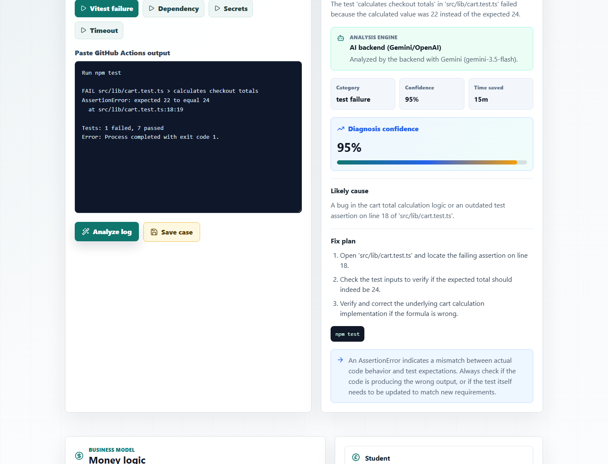
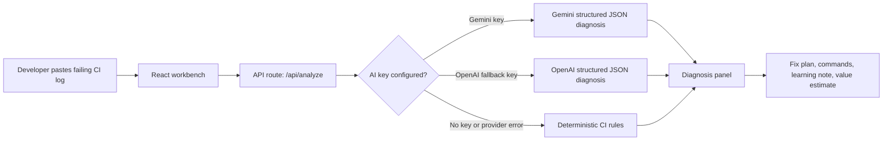
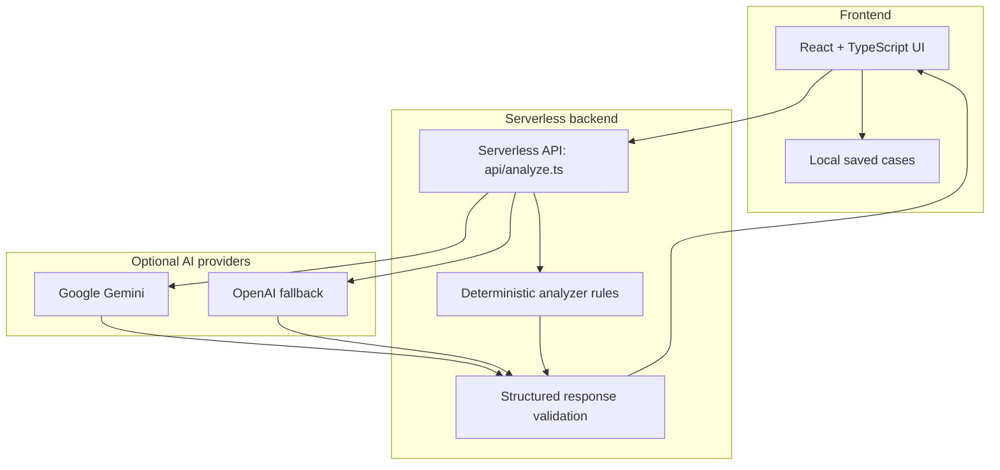
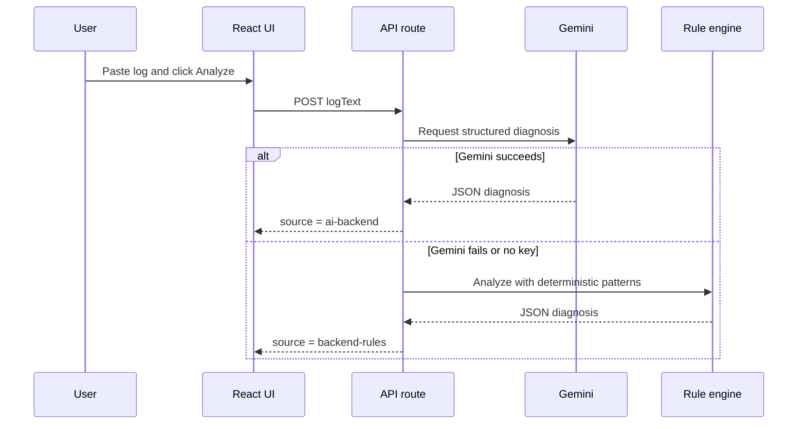
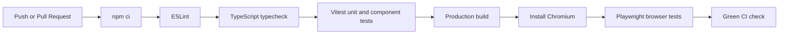

# CI Doctor

[](https://github.com/pchrysostomou/CI-Doctor/actions/workflows/ci.yml)


CI Doctor is an AI-assisted web app that turns failing GitHub Actions and test logs into a clear diagnosis, likely cause, fix plan, verification commands, and a simple value estimate.

It is built as a portfolio-ready micro-SaaS MVP for students, junior developers, bootcamp cohorts, indie hackers, and small teams who lose time reading noisy CI logs.



## What It Does

Paste a CI or test log and CI Doctor returns:

- failure category and severity
- plain-English summary
- likely root cause
- step-by-step fix plan
- commands to verify the fix locally
- short learning note for junior developers
- confidence score and estimated time saved
- saved local analysis history
- pricing/value calculator for the product idea

## Product Flow



## Architecture



## Why It Is Useful

CI logs are often long and stressful. CI Doctor compresses the useful part into a practical debugging plan.

Example input:

```text
FAIL src/lib/cart.test.ts > calculates checkout totals
AssertionError: expected 22 to equal 24
Error: Process completed with exit code 1.
```

Example output:

```text
Cart Checkout Totals Assertion Failure
Likely cause: checkout calculation logic or test expectation mismatch.
Fix plan: inspect the failing test, verify the inputs, then correct the calculation or expectation.
Command: npm test
```

## AI Backend

The app works with or without an AI key.

Provider order:

1. Gemini when `GEMINI_API_KEY` is configured
2. OpenAI when `OPENAI_API_KEY` is configured as fallback
3. deterministic backend rules when no AI provider is available
4. browser rules if the local backend is unreachable



## Local Setup

Install dependencies:

```bash
npm install
```

Create a local env file:

```bash
cp .env.example .env.local
```

Add your own Gemini key to `.env.local`:

```bash
GEMINI_API_KEY=
GEMINI_MODEL=gemini-3.5-flash
```

Run the app:

```bash
npm run dev
```

Open:

```text
http://127.0.0.1:5173
```

The Vite dev server also runs the local `/api/analyze` route, so the same Analyze button works locally and on Vercel.

## Security

Real API keys must never be committed.

Safe files:

- `.env.example` contains empty placeholders only
- `.env.local` is ignored by Git
- GitHub Actions runs without real AI keys
- Playwright uses deterministic mocked analysis for stable automation

Ignored local files include:

- `.env`
- `.env.*`
- `dist`
- `test-results`
- `playwright-report`
- `node_modules`
- `*.log`

If an API key was ever pasted in chat or committed by mistake, revoke it and create a new one.

## Tests And CI

The project includes a full GitHub Actions workflow.



Run everything locally:

```bash
npm run ci
```

Individual commands:

```bash
npm run lint
npm run typecheck
npm run test:unit
npm run build
npm run test:e2e
```

Test coverage includes:

| Layer | Tool | What it checks |
| --- | --- | --- |
| Analyzer rules | Vitest | dependency errors, failing tests, missing secrets, timeouts, lint, TypeScript failures |
| API route | Vitest | deterministic fallback, Gemini provider call, invalid methods |
| React UI | Testing Library | demo switching, custom logs, saved cases, AI backend display |
| Browser flow | Playwright | analyze log, save case, pricing calculator, custom secret failure |
| GitHub CI | Actions | lint, typecheck, tests, build, browser automation |

## Deployment On Vercel

1. Import the GitHub repository into Vercel.
2. Set the build command to `npm run build`.
3. Set the output directory to `dist`.
4. Add environment variables in Vercel project settings.

Required for Gemini AI:

```bash
GEMINI_API_KEY=
GEMINI_MODEL=gemini-3.5-flash
```

Optional fallback:

```bash
OPENAI_API_KEY=
OPENAI_MODEL=gpt-5.4-mini
```

Never use `VITE_` for secret AI keys. `VITE_` variables are exposed to the browser.

## Business Model

CI Doctor can become a small paid product because it saves debugging time.

| Plan | Price idea | Target user |
| --- | ---: | --- |
| Student | Free to GBP 7/month | students and junior developers |
| Pro | GBP 19/month | indie hackers and freelancers |
| Team | GBP 79/month | small teams and bootcamps |
| Education | custom | university or bootcamp cohorts |

Future paid features:

- GitHub OAuth and repository import
- PR comment bot for failed workflows
- shared team history
- flaky test detection reports
- private organization dashboard
- generated fix PR suggestions

## Tech Stack

| Area | Choice |
| --- | --- |
| Frontend | React, TypeScript, Vite |
| UI | Custom CSS, Lucide icons |
| Backend | Vercel-compatible serverless API route |
| AI | Gemini primary, OpenAI fallback |
| Testing | Vitest, Testing Library, Playwright |
| CI | GitHub Actions |

## Project Structure

```text
api/
  analyze.ts          serverless AI and fallback analyzer route
  analyze.test.ts     backend tests with mocked Gemini
e2e/
  ci-doctor.spec.ts   Playwright browser tests
src/
  App.tsx             main product UI
  App.css             responsive product styling
  data/logSamples.ts  demo CI logs
  lib/analyzer.ts     deterministic CI analysis engine
  lib/apiClient.ts    frontend API client with browser fallback
docs/
  ci-doctor-ui.png    README product screenshot
.github/workflows/
  ci.yml              GitHub Actions quality gate
```

## Current Status

- Gemini works locally through `/api/analyze`
- fallback rules keep the app usable with no key
- all tests pass locally
- GitHub Actions is green on `main`
- no real API key is tracked in the repository
